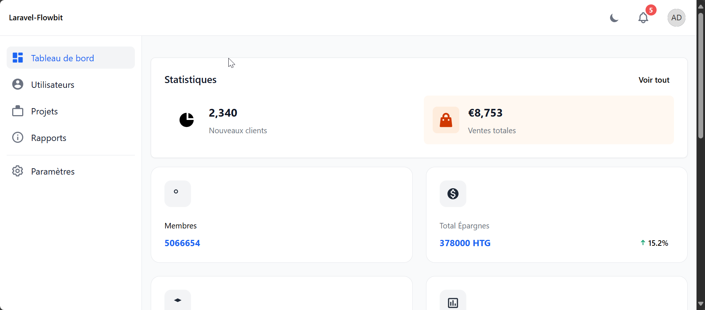

# Laravel Flowbite Starter Kit 🚀  

  

A **modern** and **easy-to-use** Laravel starter kit integrated with Flowbite UI components. Kickstart your projects effortlessly with pre-built authentication, role management, and a sleek dashboard. Ideal for developers who want a clean, responsive design without starting from scratch.

---

## 🌟 Features  
- 🔐 **Complete Authentication** (Login, Register, Reset Password)  
- 🎨 **Modern UI** with Flowbite and Tailwind CSS  
- 🌓 **Dark/Light Mode** support  
- 👥 **Role and Permission Management**  
- 📱 **Responsive Design** for all devices  
- 🔔 **Notification System**  
- 📊 **Reactive Dashboard** with a modern look  

---

## 🛠️ Technologies Used  
- **Laravel** v10.x  
- **PHP** >= 8.1  
- **Tailwind CSS** v3.x  
- **Flowbite** v2.x  
- **Alpine.js** v3.x  
- **MySQL** v8.0 / **SQLite**  

---

## ⚙️ Prerequisites  
Make sure you have the following installed:  
- **PHP** >= 8.1  
- **Composer**  
- **Node.js** & **NPM**  
- **MySQL** or **SQLite**  

---

## 🚀 Installation  

### 1. Clone the Repository 
    git clone https://github.com/votre-nom/laravel-flowbite.git
    cd laravel-flowbite

### 2. Installer les dépendances:
    composer install
    npm install

### 3. Configurer l'environnement:
    cp .env.example .env
    php artisan key:generate

### 4. Configurer la base de données:

- Modifier le fichier .env avec vos informations de base de données
- Pour SQLite:
  
      touch database/database.sqlite

### 5. Migrer et peupler la base de données:
bash
    php artisan migrate --seed

### 6. Compiler les assets:
bash
    npm run dev

### 7. Démarrer le serveur:
bash
    php artisan serve

8. Accéder à l'application:
    - URL: http://localhost:8000
    - Identifiants par défaut:
        - Super Admin: superadmin@example.com / password123
        - Admin: admin@example.com / password123

