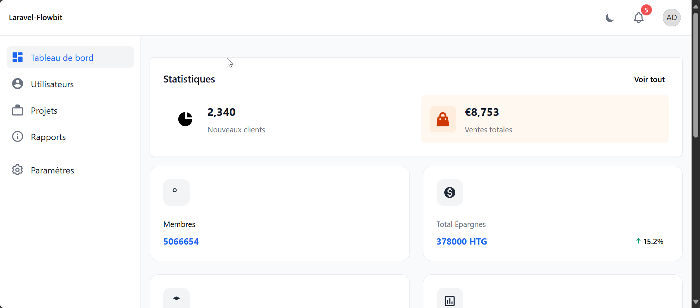

# Laravel Flowbite Starter Kit 🚀  

<div align="center">
  
</div>


A **modern** and **easy-to-use** Laravel starter kit integrated with Flowbite UI components. Kickstart your projects effortlessly with pre-built authentication, role management, and a sleek dashboard. Ideal for developers who want a clean, responsive design without starting from scratch.

---

## 🌟 Features  
- 🔐 **Complete Authentication** (Login, Register, Reset Password with Email Recovery)  
- 🎨 **Modern UI** with Flowbite and Tailwind CSS  
- 🌓 **Dark/Light Mode** support with synchronized theme management
- 👥 **Advanced Role and Permission Management** with automated permission generation
- 📱 **Responsive Design** for all devices  
- 🔔 **Notification System**  
- 📊 **Native Analytics System** with real-time data collection and dashboard metrics
- 🌍 **Multi-language Support** (English/French) with complete translation system
- 👤 **User Management CRUD** (Create, Read, Update, Delete users with role assignment)
- 📝 **Blog Management System** with rich text editor and image upload
- ⚙️ **Unified Settings Interface** (Profile, Password, Appearance in one page)
- 🤖 **Automated Permission System** for controller creation and synchronization
- 📸 **Advanced File Management** with image upload and storage linking
- ✨ **Rich Text Editor** (Quill.js) with formatting tools and inline image upload
- 📈 **Real-time Analytics Dashboard** with page views, user activities, and content statistics
- 📧 **SMTP Email System** with password reset functionality  

---

## 🛠️ Technologies Used  
- **Laravel** v10.x  
- **PHP** >= 8.1  
- **Tailwind CSS** v3.x  
- **Flowbite** v2.x  
- **Alpine.js** v3.x for reactive components
- **Quill.js** v2.x for rich text editing
- **Spatie Laravel Permission** for role-based access control
- **MySQL** v8.0 / **SQLite**  

---

## 🎯 Key Components Added

### 📈 **Native Analytics System**
- **Real-time Data Collection**: Automatic tracking via middleware
- **4 Analytics Tables**: page_views, daily_metrics, user_activities, content_stats
- **Live Dashboard**: Real metrics displayed in admin dashboard
- **Performance Tracking**: Page views, unique visitors, user activities
- **Content Analytics**: Track blog views and engagement
- **Automated Metrics**: Daily aggregation and reporting

### 📧 **Email System & Password Recovery**
- **SMTP Integration**: Full email sending capability with SSL/TLS
- **Password Reset**: Secure token-based password recovery
- **Email Templates**: Beautiful responsive email templates
- **Multi-provider Support**: Compatible with various SMTP providers

### 🌍 **Translation System**
- Complete bilingual support (English/French)
- JSON-based translation files
- Automatic language switching
- All interface elements translated

### 👥 **User Management**
- **CRUD Operations**: Create, edit, delete users
- **Role Assignment**: Assign multiple roles to users
- **Permission Control**: Fine-grained access control
- **Bulk Actions**: Manage multiple users at once

### 🛡️ **Advanced Permission System**
- **Automated Permission Generation**: Auto-create permissions for new controllers
- **Artisan Commands**: `php artisan make:admin-controller Blog --resource`
- **Permission Synchronization**: `php artisan permission:sync`
- **Role-based Access**: Protect routes and UI elements with permissions

### 📝 **Blog Management**
- **Rich Text Editor**: Quill.js with full formatting toolbar
- **Image Upload**: Direct image insertion in content
- **Status Management**: Draft, Published, Archived states
- **SEO Friendly**: Automatic slug generation with uniqueness
- **Featured Images**: Upload and manage blog cover images
- **Analytics Integration**: Track blog views and engagement

### ⚙️ **Settings Management**
- **Unified Interface**: All settings in one page with navigation tabs
- **Profile Management**: Update user information
- **Password Change**: Secure password updates
- **Theme Settings**: Dark/light mode with persistence

### 🤖 **Automated Workflows**
- **Controller Creation**: `make:admin-controller` command with auto-permissions
- **Permission Sync**: Automatic permission detection and creation
- **Slug Generation**: Unique slug creation for blogs
- **File Storage**: Automatic storage linking and management
- **Analytics Tracking**: Automatic data collection via middleware  

---

## ⚙️ Prerequisites  
Make sure you have the following installed:  
- **PHP** >= 8.1  
- **Composer**  
- **Node.js** & **NPM**  
- **MySQL** or **SQLite**  

---

## 🚀 Installation  

### 1. Clone the Repository 
    git clone https://github.com/votre-nom/laravel-flowbite.git
    cd laravel-flowbite

### 2. Installer les dépendances:
    composer install
    npm install

### 3. Configurer l'environnement:
    cp .env.example .env
    php artisan key:generate

### 4. Configurer la base de données:

- Modifier le fichier .env avec vos informations de base de données
- Pour SQLite:
  
      touch database/database.sqlite

### 6. Configurer l'email (Optionnel):

Pour activer l'envoi d'emails (récupération de mot de passe, notifications):

```env
MAIL_MAILER=smtp
MAIL_HOST=your-smtp-host.com
MAIL_PORT=465
MAIL_USERNAME=your-email@domain.com
MAIL_PASSWORD=your-password
MAIL_ENCRYPTION=ssl
MAIL_FROM_ADDRESS="your-email@domain.com"
MAIL_FROM_NAME="${APP_NAME}"
```

### 7. Migrer et peupler la base de données:
```bash
php artisan migrate --seed
```

### 8. Créer le lien symbolique pour le stockage:
```bash
php artisan storage:link
```

### 9. Compiler les assets:
```bash
npm run dev
```

### 10. (Optionnel) Synchroniser les permissions:
```bash
php artisan permission:sync
```

### 11. Démarrer le serveur:
```bash
php artisan serve
```

### 12. Accéder à l'application:
- **URL**: http://localhost:8000
- **Identifiants par défaut**:
  - Super Admin: superadmin@example.com / password123
  - Admin: admin@example.com / password123

---

## 🎮 Usage Guide

### 📊 **Dashboard Access**
Navigate to the admin dashboard to access all management features:
- **Analytics Overview**: View real-time metrics, page views, and user activities
- **Users Management**: Create, edit, and manage user accounts
- **Blog Management**: Create and publish blog posts with rich content
- **Permission Management**: Assign roles and manage permissions
- **Settings**: Configure profile, password, and appearance
- **Reports**: Access detailed analytics and reporting tools

### 📈 **Analytics Features**
1. **Real-time Dashboard**: View live metrics on page views, visitors, and activities
2. **Automatic Tracking**: All user interactions are automatically tracked
3. **Performance Metrics**: Monitor site performance and user engagement
4. **Content Analytics**: Track blog post views and popularity
5. **Export Reports**: Generate and export analytics data

### 📧 **Password Recovery**
1. Go to login page and click "Mot de passe oublié ?"
2. Enter your email address
3. Check your email for the reset link
4. Follow the link to set a new password
5. Login with your new credentials

### ✍️ **Creating Blog Posts**
1. Go to **Blogs** → **New Blog**
2. Use the rich text editor with formatting tools
3. Upload images directly into content
4. Set featured image and publication status
5. Choose publication date (optional)

### 👥 **Managing Users**
1. Access **Users** section
2. Create new users with role assignment
3. Edit existing user information and roles
4. Delete users with confirmation

### 🛡️ **Permission System**
1. Use **Permissions** tab to manage roles
2. Assign users to roles in **User Roles** tab
3. Permissions are auto-generated for new controllers

### 🎨 **Customization**
- **Theme**: Switch between dark/light mode in Settings
- **Language**: Change language in the top navigation
- **Profile**: Update personal information in Settings

---

## 🔧 Custom Artisan Commands

### Create Admin Controller with Permissions
```bash
php artisan make:admin-controller ModelName --resource
```
This command:
- Creates a resource controller in `App\Http\Controllers\Admin`
- Generates corresponding permissions (view, create, edit, delete)
- Assigns permissions to admin and super-admin roles

### Synchronize Permissions
```bash
php artisan permission:sync
```
Scans all admin controllers and creates missing permissions.

### Show Current Permissions
```bash
php artisan permission:show
```
Displays all permissions and role assignments.

---

## 📁 Project Structure

```
app/
├── Console/Commands/          # Custom Artisan commands
│   ├── MakeAdminController.php
│   └── SyncPermissions.php
├── Http/
│   ├── Controllers/Admin/     # Admin controllers
│   │   ├── BlogController.php
│   │   ├── UserController.php
│   │   ├── PermissionController.php
│   │   ├── ReportsController.php
│   │   └── SettingController.php
│   └── Middleware/            # Custom middleware
│       ├── TrackPageViews.php
│       ├── TrackUserActivity.php
│       └── TrackContentViews.php
├── Models/
│   ├── Blog.php
│   ├── User.php
│   └── Analytics/             # Analytics models
│       ├── PageView.php
│       ├── DailyMetric.php
│       ├── UserActivity.php
│       └── ContentStat.php
└── Services/
    └── AnalyticsService.php   # Analytics service

resources/
├── views/
│   ├── admin/                 # Admin interface views
│   │   ├── blogs/             # Blog management
│   │   ├── users/             # User management
│   │   ├── permissions/       # Permission management
│   │   ├── reports/           # Analytics reports
│   │   └── settings/          # Settings interface
│   └── auth/                  # Authentication views
│       ├── login.blade.php
│       ├── register.blade.php
│       ├── forgot-password.blade.php
│       └── reset-password.blade.php
└── lang/                      # Translation files
    ├── en.json
    └── fr.json

database/
└── migrations/
    ├── create_analytics_tables.php
    └── ...other migrations
```


